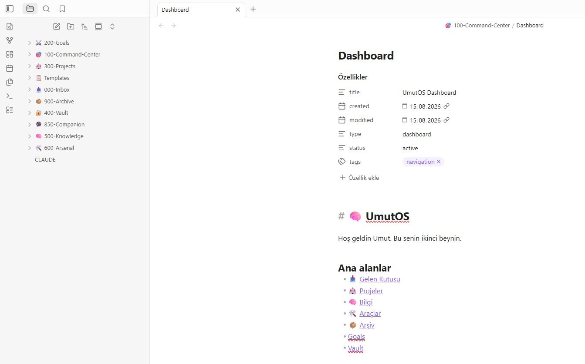
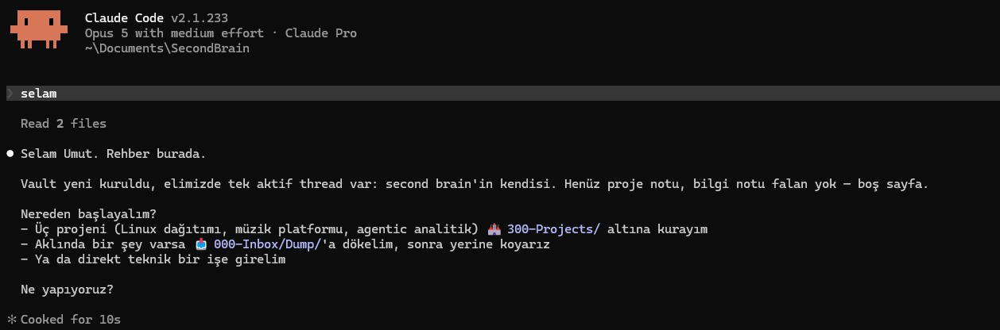

# 🧠 second-brainbro — AI-assisted second brain for Windows 11

## Türkçe

Çoğu yapay zekâ sohbeti seni her seferinde unutur. Bu unutmaz.

Notların kendi diskinde düz Markdown dosyaları olarak durur; Claude Code onları okur, düzenler ve
oturumlar arasında hatırlar. Obsidian editör olarak kullanılır — dosyalar senin, istediğin an başka
bir programla açabilirsin. Hafıza `🔮 850-Companion/` altındaki dört dosyada tutulur: kim olduğun,
geçen oturumda ne yaptığınız, açık konu başlıkların ve günlük.

Bu, [avenoxai/avenoxbeyin](https://github.com/avenoxai/avenoxbeyin) projesinin **Windows 11 portudur**.
Klasör düzeni, hafıza modeli ve süreklilik motoru aynıdır. Eklenen şey Windows tarafı ve bir güvenlik
katmanıdır: işlemsel kurucu, varsayılan kısıtlayıcı izinler, hook bütünlük kontrolü ve fail-closed
launcher.

### Nasıl görünüyor

Kurulan vault Obsidian'da — klasör düzeni, Dashboard ve alanlar arası bağlantılar:



Aynı vault'un içinden başlatılan Claude Code oturumu. Companion kendi adıyla açılıyor ve açık
thread'i sen söylemeden biliyor — bu bilgi oturum başında hook tarafından enjekte edildi:



### Çalıştığı ortam

| Bileşen | Desteklenen |
|---|---|
| İşletim sistemi | **Windows 11** (build 22000+), yerel **NTFS** sabit disk, standart kullanıcı hesabı |
| Kabuk | Windows PowerShell **5.1** veya PowerShell **7** (ikisi de CI'da test edilir) |
| Node.js | **22.23.1+** veya **24.18.0+** — kurulum ve hook'lar için gerekir |
| Obsidian | **1.12.7+**, Dynalist Inc imzalı (Authenticode doğrulanır) |
| Claude Code | **2.1.211+** — yalnızca yapay zekâ entegrasyonu için, Obsidian tek başına kullanılacaksa gerekmez |

**Windows 10:** çalışması beklenir ama denenmedi. Kurucu ve launcher işletim sistemi sürümünü
*kontrol etmez* — sürüm kontrolü yapan tek bileşen kabul doğrulayıcısıdır
(`tests\Invoke-Acceptance.ps1`). Kullanılan her şey standart Windows API'sidir: NTFS ve sabit disk
kontrolü, ACL, `HKEY_CLASSES_ROOT` protokol kaydı, reparse-point tespiti. Node.js, Obsidian ve
Claude Code da Windows 10'u destekler. Denediysen sonucu bildir, bu not güncellensin.

**Windows 8.1 ve Windows 7:** çalışmaz — engel bu projenin kodu değil, bağımlılıklar. Node.js 22/24
ve Obsidian'ın kullandığı Electron sürümü bu işletim sistemlerini artık desteklemiyor; WinGet de
Windows 7'de yok. Node.js olmadan kurucu kişiselleştirme adımını tamamlayamaz ve hook motoru hiç
çalışmaz; Obsidian olmadan launcher zaten reddeder.

**Çalışmayanlar:** macOS ve Linux (upstream macOS içindir, bu port Windows'a özgüdür), WSL, OneDrive
içindeki klasörler, ağ paylaşımları, WebDAV, NTFS olmayan diskler, junction/symlink üzerinden erişilen
yollar. Bunların hepsi kasıtlı olarak reddedilir.

### Kurulum

```powershell
git clone https://github.com/umutyalcin-pen/second-brainbro.git
cd second-brainbro
.\setup.ps1 `
  -VaultPath "$([Environment]::GetFolderPath('MyDocuments'))\SecondBrain" `
  -OsName 'BenimOS' -UserName 'Adin' `
  -UserBio 'Kendini birkac cumleyle anlat' `
  -Companion 'Rehber' -Hooks Enabled
```

Planı okuyup `CREATE` yaz. Sonra Obsidian'da **Open folder as vault** ile klasörü aç, ardından
vault içindeki `Open-SecondBrain.ps1 -Claude` ile başlat.

### Neyi vaat etmez

Bu kişisel bir araçtır, ürün değildir; imzalı bir sürümü yoktur ve dağıtılmış bir yayın planlanmıyor.
Notların diskinde durur ama sistem **çevrimdışı değildir** — Claude'a giden içerik yapılandırdığın
servise ulaşır. Vault'a parola, API anahtarı veya kurtarma kodu koyma. Kurucu bir güncelleyici
değildir: yeni bir sürüme geçmek elle taşıma gerektirir. Ayrıntılar için aşağıdaki İngilizce bölüme,
[PRIVACY.md](PRIVACY.md) ve [THREAT_MODEL.md](THREAT_MODEL.md) dosyalarına bak.

---

## English

An experimental Windows 11 port of
[avenoxai/avenoxbeyin](https://github.com/avenoxai/avenoxbeyin), built around Obsidian,
Claude Code, and local Markdown memory files. The imported upstream baseline is commit `3961c0c`.

> **Security status: public source preview (alpha), not a release.** The code is public for review and
> synthetic testing, but no hardened release is supported yet. Do not use this repository for
> irreplaceable notes, credentials, or other high-impact secrets.

The vault files live on your disk. Claude Code is still a networked AI client: notes read by Claude
or injected by hooks may be processed by the configured Claude service. Read
[PRIVACY.md](PRIVACY.md) and [THREAT_MODEL.md](THREAT_MODEL.md) before enabling hooks.

## Documentation map

- [SETUP.md](SETUP.md) — reviewed Windows installation and post-install verification runbook
- [ARCHITECTURE.md](ARCHITECTURE.md) — installer, launcher, hook, state, and trust-boundary map
- [PRIVACY.md](PRIVACY.md) — local data, networked AI processing, retention, and deletion
- [THREAT_MODEL.md](THREAT_MODEL.md) — supported deployment, threats, controls, and residual risk
- [TROUBLESHOOTING.md](TROUBLESHOOTING.md) — fail-closed diagnostics and safe recovery
- [SECURITY.md](SECURITY.md) — private vulnerability reporting and security support policy
- [PROVENANCE.md](PROVENANCE.md) — upstream baseline, transformations, license, and release limits
- [ACCEPTANCE.md](ACCEPTANCE.md) — Phase 7 fresh Windows host gates and evidence protocol
- [CONTRIBUTING.md](CONTRIBUTING.md) — synthetic-data issue and pull-request requirements

## Current installation policy

Installation from mutable `main`, a live URL, or an unreviewed fork is intentionally unsupported.
A future release quickstart will pin a reviewed immutable tag and publish verification material.

For source review and synthetic testing only, clone the repository, detach at the exact commit being reviewed, and run
the local transactional installer. Do not substitute a branch name for the reviewed commit SHA.

```powershell
git clone https://github.com/umutyalcin-pen/second-brainbro.git
cd second-brainbro
$reviewedCommit = Read-Host 'Enter the exact reviewed 40-character commit SHA'
if ($reviewedCommit -cnotmatch '^[0-9a-f]{40}$') { throw 'A full lowercase commit SHA is required.' }
git switch --detach $reviewedCommit
if ($LASTEXITCODE -ne 0) { throw 'The reviewed commit is unavailable locally.' }
git status --short
git rev-parse HEAD
Get-Content -Raw .\setup.ps1
Get-Content -Raw .\THREAT_MODEL.md

.\setup.ps1 `
  -VaultPath "$([Environment]::GetFolderPath('MyDocuments'))\SecondBrain" `
  -OsName 'ExampleOS' `
  -UserName 'Example User' `
  -UserBio 'Local Windows second brain for reviewed notes' `
  -Companion 'Guide' `
  -Hooks Disabled `
  -DryRun
```

Remove `-DryRun` only after reviewing the canonical plan. The installer then requires the exact
interactive confirmation `CREATE`. Project hooks remain disabled unless `-Hooks Enabled` is supplied;
the installer still creates gitignored permission-only local settings that deny Claude shell tools and
sensitive-path reads/edits independently of the launch directory. Missing package installation additionally requires `-InstallPrerequisites` and a
separate exact `INSTALL` confirmation for each displayed, version-pinned package.

The installer refuses existing targets, relative/UNC/network paths, OneDrive, non-NTFS or non-fixed
volumes, system locations, Windows reserved names, and reparse-point ancestors. It protects staging
with a non-inheriting ACL limited to the current user, SYSTEM, and Administrators, verifies the vault,
then exposes it using one same-volume directory rename. On
failure it removes only its validated staging directory and never rolls back unrelated package changes.

## What the scaffold contains

```text
<VaultPath>/
├── CLAUDE.md                 # companion persona, conventions, and security boundaries
├── Open-SecondBrain.ps1      # validated, opt-in local launcher
├── 📥 000-Inbox/             # Inbox.md + Dump/ for raw capture, processed on request
├── 🎯 100-Command-Center/    # Dashboard.md
├── 🏰 300-Projects/          # Projects.md; one folder per project
├── 🧠 500-Knowledge/         # Knowledge.md; knowledge by domain
├── 🛠️ 600-Arsenal/           # Arsenal.md; tools, contacts, resources
├── 🔮 850-Companion/         # Core.md, Last-Session.md, Threads.md, Journal.md
├── 📦 900-Archive/           # Archive.md
├── 📋 Templates/             # Note.md
├── .gitignore                # keeps local settings and hook state out of any Git history
└── .claude/                  # default permissions, opt-in hooks, manifest, and local state
```

Four optional folders are created only when `-OptionalArea` requests them: `⚔️ 200-Goals/`,
`🔐 400-Vault/`, `💪 700-Body/`, and `🧘 800-Mind/`. Each one adds its own index note and
Dashboard link.

- **Named companion** — user-selected name and Turkish-first interaction style.
- **Local Markdown memory** — `Core.md`, `Last-Session.md`, `Threads.md`, and `Journal.md` remain
  readable without a proprietary database.
- **Opt-in continuity hooks** — no tracked project setting automatically enables repository code.
- **Default restrictive permissions** — every installed vault receives gitignored local settings;
  shell tools and built-in reads/edits of sensitive paths are denied with filesystem-root-anchored rules
  even when continuity hooks remain off.
- **Drift detection** — after activation, the packaged hook bytes are compared to the manifest on
  every call. A mismatch suppresses memory injection and continuity-state changes. User-owned
  `settings.local.json` is deliberately not pinned, so editing your own permission rules never raises
  a warning; the installer verifies that file against the reviewed example instead. Release
  provenance must be verified separately.
- **Bounded context** — only selected, size-limited memory sections are injected and they are marked
  as untrusted data.
- **Session-safe state** — hook input is validated against the expected event, raw Claude session IDs
  are SHA-256-derived before path use, and concurrent prompt calls use exclusive marker files instead
  of a shared counter.
- **No project secrets** — Mem0 and API-key storage are not part of the public source preview.
- **Safe local launch plan** — `Open-SecondBrain.ps1 -DryRun` validates the vault, local NTFS
  location, Obsidian protocol registration, and optional Claude command without starting a process.
  Normal launch opens the Dashboard through an encoded Obsidian URI. Claude starts only with
  `-Claude` and the exact interactive confirmation `CLAUDE`.

## Memory and privacy

When enabled, the SessionStart hook adds bounded sections from `Last-Session.md` and `Threads.md` to
Claude's context. `CLAUDE.md` also asks Claude to read `Core.md` as user-approved factual context.
These files must not contain passwords, tokens, private keys, recovery codes, or similarly sensitive
information.

Claude Code command hooks receive JSON on stdin. The current implementation requires the documented
`session_id` and matching `hook_event_name` fields before memory injection or state mutation. Session
state is capped at 64 directories with a seven-day stale limit. Pending reflection notices are capped
at 32 with a 30-day limit, and at most three are atomically claimed by one starting session. Raw session
IDs are neither stored nor logged. See the official
[Claude Code hooks reference](https://code.claude.com/docs/en/hooks) for the upstream event contract.

The `🔐 400-Vault/` optional folder is denied to Claude's built-in read and edit tools, while the
hardened local settings deny the Bash and PowerShell tools entirely. A user can still change settings
or select a permission-bypass mode, so this is defence in depth, not encryption or a credential
manager.

## Requirements

- Windows 11 on a local NTFS volume
- Windows PowerShell 5.1 or PowerShell 7 (both covered by Windows CI)
- Patched Node.js 22 LTS (`22.23.1+`) or 24 LTS (`24.18.0+`); required for installation and for
  continuity hooks, while other/EOL lines are rejected
- Authenticode-signed Obsidian 1.x `1.12.7+` published by Dynalist Inc
- Claude Code `2.1.211+` for AI integration; it is not required for Obsidian-only use
- A standard Windows user account
- Git for development source acquisition; it is not required by an installed vault
- WinGet only when `-InstallPrerequisites` is requested

OneDrive-hosted vaults, Mem0, WSL, WebDAV, network shares, unattended installation, and Obsidian
community plugins are outside the supported public-source-preview configuration.

## Security controls and limitations

| Area | Current control | Important limitation |
|---|---|---|
| Source provenance | Clean public root documents the upstream baseline and private development archive; future install pins an immutable reviewed release | No signed hardened release exists yet |
| Claude permissions / hook activation | Permission-only `settings.local.json` is always installed; hook commands appear only after explicit opt-in | User settings or bypass modes can remove this boundary |
| Hook drift | Fixed SHA-256 manifest over packaged hook bytes; mismatch skips memory/continuity-state work; the installer separately verifies local settings against the reviewed example | Same-user attacker can replace code and manifest together; user-editable `settings.local.json` is not pinned at runtime by design |
| Installation | Existing-target refusal, protected private staging ACL, per-target lock, pre-commit verification, atomic directory rename | Version-pinned package installs are external changes and are not rolled back |
| Personalization | Fixed file allowlist, canonical containment, link rejection, preflight validation | Transaction protects a new install; it is not an updater for existing vaults |
| Launcher | Vault-relative fixed entry point, local-path and reparse checks, encoded Obsidian URI, encoded literal Claude command, dry-run, explicit Claude consent | Same-user modification and unreviewed source remain outside its protection |
| Automated verification | Windows PowerShell 5.1/Node 22 and PowerShell 7/Node 24 exercise installation, hooks, launcher selection, navigation, encoding, documentation links/contracts, and secret patterns | GitHub-hosted runners and pinned toolchain artifacts remain external dependencies |
| Clean-machine acceptance | Read-only verifier and evidence protocol cover reviewed source, standard-user host, dry-run, installed vault, launcher, and hooks | Fresh VM/physical-machine evidence is still pending |
| Memory injection | Size cap, narrow sections, untrusted-data delimiters | Prompt-injection resistance is not absolute |
| Concurrent sessions | SHA-256 session keys, exclusive prompt markers, closing sentinel, atomic reflection claims, bounded cleanup | Same-user tampering and abrupt process/storage failure remain out of scope |
| Secrets | Filesystem-root-anchored sensitive Read/Edit denies plus complete Bash/PowerShell tool denies; no API-key feature | Settings can be changed or bypassed; `.gitignore` is not encryption |
| Cloud sync | Unsupported in the public source preview | Manual OneDrive placement can still upload the vault |

Claude Code command hooks run with the Windows user's permissions. Review the hook code and active
settings with `/hooks` before use.

## Project status and scope

This is a personal tool, shared with a small group of readers. It is not a product, it is not sold,
and no distributed release is planned. The source is public so that anyone who runs it can read
exactly what it does first.

Built and covered by Windows CI:

- Phases 0–1: threat model and critical security controls
- Phase 2: transactional Windows installer
- Phase 3: session-safe hook engine
- Phase 4: complete Obsidian navigation and fail-closed local launcher
- Phase 5: automated Windows tests and least-privilege CI
- Phase 6: Windows architecture, security, recovery, provenance, and documentation contract

Out of scope at this size:

- Phase 7 clean-machine acceptance — the protocol and its driver are implemented and usable
  ([ACCEPTANCE.md](ACCEPTANCE.md)), but fresh-environment evidence exists to reassure third parties
  installing an unfamiliar release, which is not what this repository is for. It has never been run,
  and the repository does not claim otherwise anywhere.
- Phase 8 signed release and immutable verification material — same reason.

Known gaps that matter to anyone who does run it:

- **No updater.** The installer creates a new vault; it never updates, merges into, or repairs an
  existing one. Adopting a newer commit in an existing vault is currently a manual operation.
- **No uninstaller.** Removing a vault means deleting its folder.
- **The prerequisite installation path has never been executed.** `-InstallPrerequisites` calls WinGet
  for pinned Node.js and Obsidian versions; every environment used so far already had both, so that
  branch is verified by reading it, not by running it. Install the prerequisites yourself if you want
  to stay on proven ground.

## License and provenance

MIT — see [LICENSE](LICENSE). Derived from Avenox's original template; the original copyright notice
is retained. See [PROVENANCE.md](PROVENANCE.md) for the exact imported commit and material Windows
transformations. This repository is currently a derived repository rather than a GitHub-native fork.
